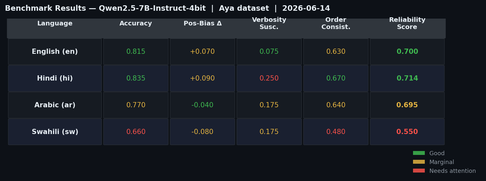
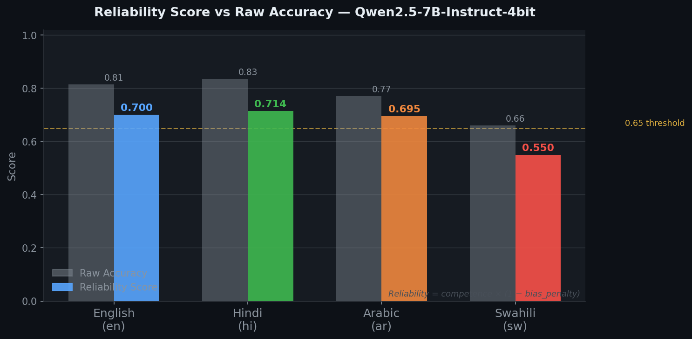
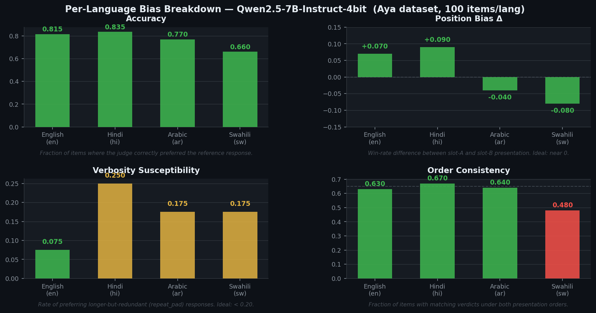
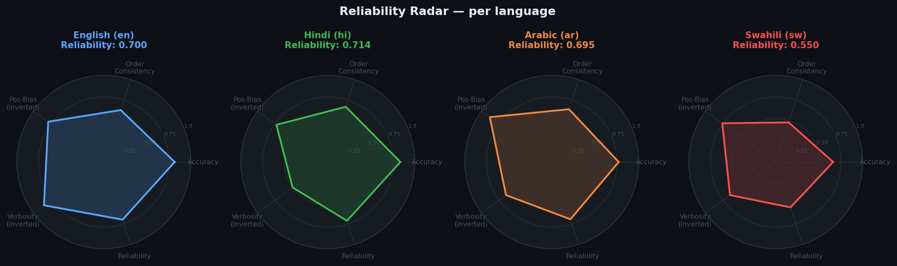

# BabelJudge

[](https://arxiv.org/abs/2606.22329)
[](https://doi.org/10.5281/zenodo.20807412)
[](LICENSE)

**Stress-testing the reliability of LLM judges across languages.**

LLM-as-a-judge is now the default evaluation method in most NLP and agent pipelines. BabelJudge audits the auditors — measuring how reliably a judge model picks the better response when the task is in Arabic, Swahili, Hindi, or any of a dozen other languages, not just English.

It does not train anything. It does not need human preference labels. It measures.

---

## Benchmark results

> Run: **2026-06-14** · Model: `mlx-community/Qwen2.5-7B-Instruct-4bit` · Data: Aya dataset · Languages: en, hi, ar, sw · 10 refs/lang · 800 judge calls total

### Leaderboard

| Rank | Judge | Reliability | Macro-Acc | Languages |
|---|---|---|---|---|
| 1 | Qwen2.5-7B-Instruct-4bit | **0.665** | 0.770 | en, hi, ar, sw |

### Results table



Color coding: **green** = good, **yellow** = marginal, **red** = needs attention.

### Reliability vs raw accuracy



Raw accuracy stays above 0.66 for all languages. Reliability drops sharply for Swahili (0.550) once bias and order-inconsistency penalties are applied — the gap between what accuracy shows and what reliability reveals is widest for the lowest-resource language.

### Per-metric bias breakdown



Key observations:
- **Verbosity susceptibility** is clean in English (0.075) but rises to 0.25 in Hindi — the judge is more easily fooled by longer text in Hindi
- **Order consistency** collapses to 0.48 in Swahili — the judge is effectively flipping a coin when the pair order is swapped, making Swahili eval results noise-dominated
- **Position bias Δ** is within acceptable range (|Δ| < 0.10) for all languages

### Per-language reliability radar



Each axis represents a normalised reliability dimension. Larger area = more reliable judge. The Swahili polygon is notably smaller and more irregular, driven by its low order-consistency.

---

## The problem

Judge models carry systematic biases that raw accuracy hides:

- They favor whichever response appears in slot A (**position bias**)
- They prefer longer responses regardless of quality (**verbosity bias**)
- Their agreement with humans collapses in lower-resource languages
- They are internally inconsistent — they flip their verdict when you swap the slots

These biases are documented in scattered one-off studies. BabelJudge provides a single, reusable instrument that measures all of them on any judge model, in a comparable way across languages.

---

## How it works

BabelJudge constructs **gold-labeled judging items for free**, without human annotation.

```
high-quality reference response
         │
         ├── truncate        → information loss
         ├── shuffle         → coherence loss
         ├── number_corrupt  → factual error
         ├── drop_entities   → missing specifics
         └── repeat_pad      → longer, but redundant   ← verbosity-bias trap
```

Each perturbation produces a (reference, degraded) pair where the reference is known to be better **by construction**. Every pair is then shown to the judge under **both presentation orders** — reference first, then perturbed first — so position bias and order-consistency are directly observable, not inferred.

The result is a per-language **reliability card** for each judge, and a **leaderboard** that ranks judges not by raw accuracy alone, but by a composite score that penalizes measured bias.

---

## Why raw accuracy is not enough

On four of the five perturbation types, the better response also happens to be the shorter one. A judge that systematically prefers longer text will look accurate — until you isolate the `repeat_pad` probe where the *worse* response is the *longer* one. BabelJudge exposes that gap:

```
                  raw accuracy    reliability score
fair-7b               0.844            0.726        ← small discount
verbose-7b            0.750            0.291        ← fooled by length
slotA-7b              0.678            0.317        ← position-biased
```

A judge that scores well on reliability is actually reliable. A judge that scores well only on accuracy may not be.

---

## Metrics

Each judge receives a card per language:

| Metric | What it measures |
|---|---|
| `accuracy` | Order-balanced reference-win-rate |
| `position_bias_delta` | Win-rate difference between slot-A and slot-B presentation |
| `verbosity_susceptibility` | Rate of preferring longer-but-redundant responses |
| `order_consistency` | Fraction of items decided the same way under both orders |
| `reliability_score` | Competence gated by measured bias — the headline number |

---

## Who this is for and what to do with the results

BabelJudge produces numbers. This section explains who those numbers matter to and what concrete actions follow from them.

### Who uses this

| Stakeholder | Core question BabelJudge answers |
|---|---|
| **Eval engineers** | "Can I trust my automated eval results in Arabic? In Swahili?" |
| **Training data teams** | "How noisy is the preference signal my judge is producing for RLHF/DPO in low-resource languages?" |
| **Product teams** | "Which languages need human reviewers instead of an automated judge?" |
| **Safety teams** | "Which languages have a gap in automated content screening reliability?" |
| **Judge model developers** | "Where does my model fail as a judge, and what should I fine-tune on?" |
| **ML researchers** | "Is this benchmark result trustworthy, given the judge's known reliability in this language?" |

---

### Reading the numbers

#### Reliability score

The headline number for each (judge, language) pair.

| Range | Interpretation | Suggested action |
|---|---|---|
| ≥ 0.70 | Trustworthy. Judge is accurate and internally consistent. | Use directly; report results with standard confidence intervals. |
| 0.55–0.70 | Marginal. Accuracy is reasonable but bias or inconsistency adds noise. | Apply mitigations (see below). Widen confidence intervals. |
| < 0.55 | Near-unusable. The judge is close to chance or systematically biased. | Do not use for consequential decisions. Route to a better judge or human review. |

From our first run: Qwen2.5-7B is acceptable for English/Hindi/Arabic (0.695–0.714) but should not be used as the sole judge for Swahili (0.550).

#### Position bias Δ

How much the judge's verdict shifts depending on which slot (A or B) a response is placed in.

- **|Δ| < 0.10** — Minimal slot preference. Safe to use single-order evaluation.
- **|Δ| > 0.15** — The judge is slot-dependent. If you present responses in one fixed order, your eval is systematically skewed. Always use both orders and average, or results are unreliable.
- **Sign matters**: +Δ means the judge favors slot A; −Δ means it favors slot B.

#### Verbosity susceptibility

How often the judge is fooled by a longer-but-lower-quality response (the `repeat_pad` probe).

- **< 0.20** — Rarely fooled by length. Safe for evals where response length varies.
- **0.20–0.40** — Moderate length bias. Normalize response lengths before judging if length can legitimately vary in your use case.
- **> 0.40** — Strongly fooled by length. A judge with this score will systematically prefer wordy responses over concise ones regardless of quality. In RLHF data collection, this produces training signal that incentivizes verbosity.

From our first run: Qwen2.5-7B is clean in English (0.075) but noticeably length-biased in Hindi (0.250). Hindi training data labeled by this judge will skew toward longer responses.

#### Order consistency

Fraction of items where the judge gives the same verdict under both presentation orders.

- **> 0.70** — Consistent. The judge is confident.
- **0.55–0.70** — Inconsistent on roughly 30–45% of items. The judge is uncertain; treat close verdicts as ties.
- **< 0.55** — Unreliable. The judge is essentially flipping a coin on many items. Even its "correct" verdicts may be coincidental.

Swahili order consistency of **0.48** from our run means the judge disagrees with itself more often than it agrees. Any Swahili eval result from this model is noise-dominated.

---

### Concrete actions

#### 1. Judge selection

Use the leaderboard to pick the right judge for your language set before running a real eval — not after.

```python
# Run BabelJudge on candidate judges first
from babeljudge import create_judge, from_aya, build_dataset, evaluate

candidates = [
    create_judge("mlx", "mlx-community/Qwen2.5-7B-Instruct-4bit"),
    create_judge("mlx", "mlx-community/aya-expanse-8b-4bit"),
    create_judge("anthropic", "claude-haiku-4-5"),
]
items = build_dataset(from_aya(["sw", "yo", "bn"], n_per_lang=25))
results = evaluate(candidates, items)
# Pick the judge with highest reliability for your target languages
```

#### 2. Language routing

Don't use the same judge for all languages if reliability differs dramatically. Route low-resource items to a more capable judge or human review.

```python
# Pseudocode: per-language judge routing
judge_for = {
    "en": qwen_7b,    # reliability 0.70 — acceptable
    "hi": qwen_7b,    # reliability 0.71 — acceptable
    "ar": qwen_7b,    # reliability 0.695 — acceptable
    "sw": aya_8b,     # qwen is 0.55 — route to multilingual-specialized model
}
```

#### 3. Verbosity debiasing

If verbosity susceptibility is > 0.20, normalize response lengths before the judge sees them:

```python
def truncate_to_shorter(a: str, b: str):
    """Clip both responses to the shorter one's word count."""
    wa, wb = a.split(), b.split()
    n = min(len(wa), len(wb))
    return " ".join(wa[:n]), " ".join(wb[:n])
```

This removes the length cue the judge is abusing without changing content. Re-run BabelJudge after to verify the susceptibility drops.

#### 4. Training data quality control (RLHF / DPO)

If you are using an LLM judge to label preference pairs for fine-tuning, reliability directly determines label noise:

- Reliability 0.70 → ~30% of "chosen" labels may be wrong
- Reliability 0.55 → ~45% may be wrong — nearly unusable for training

Mitigation options, in order of cost:
1. **Discard inconsistent items**: if the judge flips verdict across both orders, treat the pair as unlabeled. Reduces coverage but raises precision.
2. **Use a better judge**: route low-resource language pairs to a larger or multilingual-specialized model.
3. **Human review**: for languages where no judge exceeds your reliability threshold, collect human preferences.
4. **Jury voting**: run 3 judges and take the majority vote. Reduces variance but doesn't eliminate bias.

#### 5. Eval result qualification

When publishing benchmark results obtained with an LLM judge, report the judge's BabelJudge reliability alongside. A result like:

> "Our model scores 0.74 on the Swahili eval"

should be accompanied by:

> "(evaluated with Qwen2.5-7B, BabelJudge reliability for Swahili: 0.55 — results should be interpreted cautiously)"

This prevents the field from treating unreliable automated eval numbers as ground truth.

#### 6. Improving a judge model

If you are developing or fine-tuning a judge model, BabelJudge gives you a targeted training signal:

| Signal | What to do |
|---|---|
| Low reliability in specific languages | Collect more judge training data in those languages (e.g., human preference pairs from Aya Feedback). Fine-tune or continue-pretraining in those languages. |
| High verbosity susceptibility | Add adversarial examples where the longer response is wrong. Train explicitly on `repeat_pad`-style pairs. |
| Low order consistency | The model is uncertain. Add calibration training: teach it to abstain (output "tie") when confidence is low. |
| High position bias Δ | The model has absorbed a slot-A/B preference from training data. Debias by mixing both-order versions of the same pairs during fine-tuning. |

#### 7. The improvement loop

BabelJudge is most valuable when run repeatedly as an inner loop:

```
Run BabelJudge
    → identify which languages / bias types are worst
    → choose an intervention (new model, debiasing, human review threshold)
    → apply intervention
    → re-run BabelJudge
    → measure delta
    → iterate
```

Treat the reliability card as a living diagnostic, not a one-time score.

---

## Quick start

```bash
# Apple Silicon (fastest — native MLX inference)
pip install mlx-lm datasets
PYTHONPATH=. python examples/run_mac.py

# Colab / GPU (free T4)
# → open MultiJudge_Colab.ipynb

# Any local Ollama server
brew install ollama && ollama pull qwen2.5:7b
pip install datasets openai
PYTHONPATH=. python examples/run_mac.py   # auto-falls-back to Ollama
```

The default run loads four languages from the Aya dataset (English, Swahili, Hindi, Arabic), builds gold-labeled judging items via controlled perturbations, and scores the judge under both presentation orders. Output is a leaderboard printed to stdout and saved to `mac_leaderboard.md` and `mac_results.json`.

---

## How-to guide

### 1. Run your first benchmark (Apple Silicon)

**Prerequisites:** Python 3.9+, an M-series Mac, internet for the one-time model and data download.

```bash
git clone https://github.com/<you>/babeljudge.git
cd babeljudge
pip install mlx-lm datasets
PYTHONPATH=. python examples/run_mac.py
```

What happens step by step:

1. `from_aya(...)` streams a small slice of the Aya dataset (English, Swahili, Hindi, Arabic). First run caches ~500 MB locally.
2. `build_dataset(...)` crosses each reference with all five perturbations at two severity levels, producing 400 gold-labeled judging items (10 refs × 4 langs × 5 perturbations × 2 severities).
3. `MLXJudge` downloads `Qwen2.5-7B-Instruct-4bit` (~4.3 GB, one-time) and loads it natively via mlx-lm.
4. The harness runs every item twice — reference-first and perturbed-first — making **800 judge calls**. On an M4 Pro expect roughly 5–8 minutes.
5. Results are printed as a Markdown table and saved to `mac_leaderboard.md` and `mac_results.json`.

---

### 2. Run on a free Colab GPU

Open `MultiJudge_Colab.ipynb` in Google Colab. Before running, set the runtime to a GPU: **Runtime → Change runtime type → T4 GPU**.

The notebook walks through:
- Installing dependencies
- Uploading the repo zip
- Loading real multilingual data
- Running a 4-bit quantized judge
- Rendering the leaderboard inline

No local machine needed. Free tier is sufficient for a 7–8B model over a small language set.

---

### 3. Use a local server (Ollama / vLLM / LM Studio)

Pull a model with Ollama, then point BabelJudge at it:

```bash
brew install ollama
ollama pull qwen2.5:7b          # or aya-expanse:8b for stronger multilingual
pip install datasets openai
```

`examples/run_mac.py` auto-detects: if `mlx-lm` is not installed it falls back to Ollama at `http://localhost:11434`. To force Ollama or point at a different server, use `OllamaJudge` directly:

```python
from babeljudge import OllamaJudge, evaluate
judge = OllamaJudge("qwen2.5:7b")
# or another host:
judge = OllamaJudge("qwen2.5:7b", host="http://192.168.1.5:11434")
results = evaluate([judge], items)
```

The same `OpenAICompatLocalJudge` adapter works with vLLM, LM Studio, and llama.cpp — just change the `base_url`.

---

### 4. Connect to a cloud API

```python
from babeljudge import create_judge

# Anthropic — set ANTHROPIC_API_KEY
judge = create_judge("anthropic")                        # claude-opus-4-8
judge = create_judge("anthropic", "claude-haiku-4-5")   # faster / cheaper

# OpenAI — set OPENAI_API_KEY
judge = create_judge("openai")                           # gpt-4o
judge = create_judge("openai", "gpt-4-turbo")

# Google Gemini — set GOOGLE_API_KEY
judge = create_judge("gemini")                           # gemini-1.5-pro
judge = create_judge("gemini", "gemini-1.5-flash")

# Groq / Together / Mistral (OpenAI-compatible)
judge = create_judge("groq",     "llama-3.1-70b-versatile", api_key="gsk_...")
judge = create_judge("together", api_key="...")
judge = create_judge("mistral",  "mistral-large-latest",    api_key="...")
```

Install the relevant SDK first: `pip install anthropic` for Claude, `pip install openai` for OpenAI/Groq/Together/Mistral, `pip install google-generativeai` for Gemini.

---

### 5. Choose your languages

Edit the `LANGUAGES` list in `examples/run_mac.py`:

```python
# BCP-47 short tags for the Aya dataset (default data source)
LANGUAGES = ["en", "sw", "hi", "ar"]
```

Aya covers 65+ languages. A meaningful multilingual benchmark needs a mix of high-resource and low-resource languages — that contrast is where reliability differences surface.

Common high-resource tags: `en es fr de zh ar tr id`  
Common low-resource tags: `sw yo bn ha so am`

To use FLORES-200 (200 languages, translation tasks):

```python
from babeljudge import from_flores
sources = from_flores(["spa_Latn", "hin_Deva", "swh_Latn"], n_per_lang=25)
```

To use XL-Sum (summarization, full English language names): requires `datasets<4.0`.

---

### 6. Control sample size and perturbation severity

```python
# in examples/run_mac.py
N_PER_LANG = 25          # references per language; 25–50 for paper-grade results
SEVERITIES = (0.3, 0.6)  # fraction of content degraded; keep both for a difficulty spread
```

A single reference crossed with 5 perturbations × 2 severities = 10 items, × 2 orders = 20 judge calls. At `N_PER_LANG=25` and 4 languages you get 1,000 items and 2,000 judge calls. That is the minimum for stable per-language metrics; 50 references per language is recommended before drawing conclusions.

---

### 7. Evaluate multiple judges on one leaderboard

Pass a list to `evaluate()`:

```python
from babeljudge import create_judge, evaluate

judges = [
    create_judge("mlx",       "mlx-community/Qwen2.5-7B-Instruct-4bit",  name="qwen-7b"),
    create_judge("mlx",       "mlx-community/aya-expanse-8b-4bit",        name="aya-8b"),
    create_judge("anthropic", "claude-haiku-4-5"),
    create_judge("groq",      "llama-3.1-70b-versatile", api_key="gsk_..."),
]
results = evaluate(judges, items)
```

Each judge is scored independently on the same items under the same protocol. The leaderboard ranks all of them together so comparisons are apples-to-apples.

---

### 8. Use your own data

Any dataset that provides `(prompt, high-quality reference response)` pairs works. Use `records_to_sources` directly:

```python
from babeljudge import records_to_sources, build_dataset, evaluate

my_records = [
    {"text": "article body here...", "summary": "human-written summary..."},
    # ...
]
sources = records_to_sources(my_records, language="en", min_ref_sentences=3)
items   = build_dataset(sources, severities=(0.3, 0.6), seed=42)
results = evaluate([my_judge], items)
```

`min_ref_sentences=3` filters out references too short for perturbations to be meaningful. Raise it if you see high tie rates.

---

### 9. Read the reliability card

Each run produces a card per (judge, language). Here is how to read it:

```
judge                        qwen-7b
language                     swahili
accuracy                     0.660     ideally > 0.7
position_bias_delta          -0.080    ideally near 0; |Δ| > 0.2 is a concern
verbosity_susceptibility     0.175     > 0.5 means fooled by length
order_consistency            0.480     fraction decided same way both orders
reliability_score            0.550     competence gated by bias
n_items                      100
```

**What to look for:**
- Accuracy that drops in low-resource languages (Swahili, Yoruba) vs English signals language-specific degradation — the central finding this benchmark surfaces.
- `|position_bias_delta|` above 0.2 means the judge is slot-dependent.
- `verbosity_susceptibility` above 0.5 means the judge is fooled by the `repeat_pad` probe more often than chance.
- `order_consistency` below 0.6 suggests the judge is internally inconsistent in this language.
- `reliability_score` below 0.5 suggests the judge should not be trusted as a primary evaluator in this language.

---

### 10. Save and inspect raw results

```python
from babeljudge import save_results
save_results(results, "results.json", "leaderboard.md")
```

`results.json` contains every judgment with its raw judge output, item ID, language, and presentation order. Inspect specific failures:

```python
import json
data = json.load(open("results.json"))

# cards where the judge picked the wrong answer more than half the time in Swahili
failures = [c for c in data["cards"] if c["accuracy"] < 0.5 and c["language"] == "sw"]
```

---

### 11. Verify the installation

```bash
# no models, no internet needed
PYTHONPATH=. python examples/run_demo.py    # synthetic end-to-end run
PYTHONPATH=. python tests/test_metrics.py   # bias-recovery regression test
```

Both complete in under 10 seconds. If either fails, check that you are running from the repo root with `PYTHONPATH=.`.

---

## Installation

No package on PyPI yet. Clone and run from the repo root:

```bash
git clone https://github.com/<you>/babeljudge.git
cd babeljudge
pip install -e .                          # core (no heavy deps)
pip install mlx-lm datasets               # Apple Silicon path
pip install transformers accelerate       # GPU / Colab path
pip install openai datasets               # local server / cloud OpenAI-compat path
pip install anthropic                     # Claude API path
pip install google-generativeai           # Gemini path
```

Python 3.9+. The core package has no mandatory dependencies. Judge backends pull in their SDK lazily — only when you instantiate the relevant class.

---

## Repo layout

```
babeljudge/
  schema.py          JudgeItem and Judgment dataclasses
  perturbations.py   Controlled-degradation generator (the gold-label engine)
  judges.py          Judge interface + all backends + create_judge() factory
  metrics.py         Accuracy, bias probes, consistency, reliability score
  harness.py         Runs both orders, collects judgments, emits cards
  sources.py         Loaders for XL-Sum, Aya, FLORES-200
examples/
  run_mac.py         One-command runner for Apple Silicon (auto-falls-back to Ollama)
  run_demo.py        Fully synthetic run — no models, no network
data/
  CARD.md            Dataset card
tests/
  test_metrics.py    Regression test: bias recovery
```

---

## Connecting to any model

Use `create_judge(backend, model, **kwargs)` as the single entry point, or import the class directly.

| Backend string | Class | Requires | Notes |
|---|---|---|---|
| `"mlx"` / `"apple"` | `MLXJudge` | `pip install mlx-lm` | Fastest on Apple Silicon |
| `"transformers"` / `"hf"` | `TransformersJudge` | `pip install transformers accelerate` | GPU / Colab T4, 4-bit |
| `"ollama"` | `OllamaJudge` | `pip install openai` + Ollama running | Convenience wrapper for localhost:11434 |
| `"compat"` / `"vllm"` | `OpenAICompatLocalJudge` | `pip install openai` | Any OpenAI-compat server; pass `base_url=` |
| `"anthropic"` / `"claude"` | `AnthropicJudge` | `pip install anthropic` + `ANTHROPIC_API_KEY` | Default: claude-opus-4-8 |
| `"openai"` / `"gpt"` | `RemoteOpenAIJudge` | `pip install openai` + `OPENAI_API_KEY` | Default: gpt-4o |
| `"gemini"` / `"google"` | `GeminiJudge` | `pip install google-generativeai` + `GOOGLE_API_KEY` | Default: gemini-1.5-pro |
| `"groq"` | `OpenAICompatLocalJudge` | `pip install openai` + `api_key=` | Default: llama-3.1-70b-versatile |
| `"together"` | `OpenAICompatLocalJudge` | `pip install openai` + `api_key=` | Default: Llama-3-70b-chat-hf |
| `"mistral"` | `OpenAICompatLocalJudge` | `pip install openai` + `api_key=` | Default: mistral-large-latest |
| `"mock"` | `MockJudge` | nothing | Testing, CI, demos |

Recommended open-weight models:

- `mlx-community/Qwen2.5-7B-Instruct-4bit` (~4.3 GB, fits 16 GB+)
- `mlx-community/Qwen2.5-14B-Instruct-4bit` (~8 GB, fits 24 GB)
- `mlx-community/aya-expanse-8b-4bit` (stronger multilingual coverage)
- `CohereForAI/aya-expanse-8b` via `TransformersJudge`

---

## Adding your own judge

Subclass `Judge` and implement one method:

```python
from babeljudge import Judge

class MyJudge(Judge):
    name = "my-judge"

    def compare(self, prompt: str, a: str, b: str, instruction: str) -> str:
        # call your model; return "A", "B", or "tie"
        ...

from babeljudge import from_aya, build_dataset, evaluate
sources = from_aya(["en", "sw", "hi", "ar"], n_per_lang=25)
items   = build_dataset(sources)
results = evaluate([MyJudge()], items)
```

That's the full integration. The harness handles order randomization, normalization, and scoring.

---

## Data sources

BabelJudge uses permissively-licensed multilingual corpora as the source of reference responses. The perturbation engine manufactures the gold-labeled pairs — no annotation cost.

| Source | Task | Languages | License | Notes |
|---|---|---|---|---|
| Aya (CohereForAI/aya_dataset) | Instruction-following | 65+ | Apache-2.0 | Default; works with `datasets>=4.0` |
| FLORES-200 (facebook/flores) | Translation | 200 | CC BY-SA 4.0 | Use `from_flores()` |
| XL-Sum (csebuetnlp/xlsum) | Summarization | 44 | CC BY-NC-SA 4.0 | Requires `datasets<4.0` |

The BabelJudge code is Apache-2.0. Data slices inherit the license of their upstream source; check `data/CARD.md` for per-slice documentation.

---

## Contributing

To add a judge to the public leaderboard, open a pull request with:

1. A judge adapter in `babeljudge/judges.py` (or a standalone file)
2. The output of `evaluate([your_judge], items)` for the standard language set
3. The model card or reference for the judge model

See `CONTRIBUTING.md` for the full protocol.

---

## Agentic evaluation (tool-calling and multi-turn reasoning)

BabelJudge extends to agentic settings via `babeljudge.agentic`. The same gold-labeling-by-degradation principle transfers: instead of degrading a text response, we degrade a reference agent trajectory — wrong tool arguments, swapped tool names, hallucinated calls, missing steps. The reference trajectory is by construction the better one, with no human annotation required.

### When to use this

| Use case | Module |
|---|---|
| Cross-lingual response quality | `babeljudge` (core) |
| Tool-calling correctness | `babeljudge.agentic` |
| Multi-turn reasoning traces | `babeljudge.agentic` |
| Hallucinated tool detection | `babeljudge.agentic` |

### New perturbation types

| Perturbation | What it does | Bias probed |
|---|---|---|
| `argument_corrupt` | Change one argument value to something wrong | Basic tool-call accuracy |
| `tool_name_swap` | Replace a tool name with a wrong alternative | Tool selection accuracy |
| `hallucinated_tool` | Insert a made-up tool call between real steps | Hallucination detection |
| `missing_required_arg` | Remove a required argument from a tool call | Completeness checking |
| `extra_spurious_arg` | Add a nonsense key/value pair | Noise sensitivity |
| `drop_intermediate_step` | Remove one reasoning step from the trace | Gap detection |
| `corrupt_tool_result` | Mutate a tool's return value | Downstream consistency |
| `early_termination` | Cut the trajectory off at the midpoint | Completeness bias |
| `step_pad` | Append redundant repeated steps (LONGER trace) | **Trajectory-length bias** |

### New metrics

| Metric | Description |
|---|---|
| `tool_accuracy` | Rate of correctly preferring the reference trajectory |
| `argument_accuracy` | Accuracy specifically on argument-level errors |
| `hallucination_detection` | Rate of catching hallucinated tool calls |
| `trajectory_length_bias` | Rate of preferring the longer-but-worse trajectory |
| `order_consistency` | Consistency across both presentation orders |
| `reliability_score` | Single rankable number: competence × (1 − bias penalties) |

### Quick start (no network required)

```python
from babeljudge import create_judge
from babeljudge.agentic import (
    synthetic_tool_tasks,   # 8 built-in tasks, zero network
    build_agent_dataset,
    AgentJudge,
    evaluate_agent,
    agent_cards_to_markdown,
)

# 1. Reference trajectories (real or synthetic)
traces = synthetic_tool_tasks()

# 2. Gold-labeled items (144 items: 8 tasks × 9 perturbations × 2 severities)
items = build_agent_dataset(traces)

# 3. Wrap any text judge as an agent judge
judge = AgentJudge(create_judge("anthropic"), focus="tool_calls")
# or: focus="full_trace" to include model reasoning steps

# 4. Evaluate
results = evaluate_agent([judge], items)
print(agent_cards_to_markdown(results))
```

Run the zero-network demo (MockJudge, no API key needed):

```bash
python examples/run_agentic_demo.py
```

### Two evaluation modes

**`focus="tool_calls"`** — serialize only the tool name, arguments, and result for each call. Fast, token-efficient, good for benchmarking tool-selection quality.

```
Task: What is the current weather in Paris?

[1] get_weather(city='Paris', units='metric') -> 15°C, partly cloudy
```

**`focus="full_trace"`** — include model thoughts alongside each action. More context for multi-turn reasoning evaluation.

```
Task: What is the current weather in Paris?

Thought 1: I need to get the current weather for Paris.
Action 1: get_weather(city='Paris', units='metric')
   Result: 15°C, partly cloudy, 30% rain chance
(trace complete)
```

### Loading real tool-calling data

```python
# Berkeley Function-Calling Leaderboard (requires: pip install datasets)
from babeljudge.agentic import from_bfcl

traces = from_bfcl(n=100, categories=["weather", "finance"])
items  = build_agent_dataset(traces, perturbations=["argument_corrupt", "tool_name_swap"])
```

### Composing with the text benchmark

You can benchmark the same judge on both text responses and agent trajectories, then compare scores to understand where reliability breaks down:

```python
import babeljudge as bj
from babeljudge.agentic import AgentJudge, evaluate_agent, build_agent_dataset, synthetic_tool_tasks

# Text benchmark
text_judge  = bj.create_judge("anthropic")
text_items  = bj.build_dataset(bj.from_aya(["en", "hi", "ar", "sw"], n_per_lang=25))
text_results = bj.evaluate([text_judge], text_items)

# Agentic benchmark
agent_judge  = AgentJudge(bj.create_judge("anthropic"), focus="tool_calls")
agent_items  = build_agent_dataset(synthetic_tool_tasks())
agent_results = evaluate_agent([agent_judge], agent_items)
```

---

## Citing BabelJudge

If you use BabelJudge in your research, please cite:

```bibtex
@article{babeljudge2026,
  author        = {KC, Shreyas},
  title         = {{BabelJudge}: Measuring {LLM}-as-a-Judge Reliability Across Languages and Agent Trajectories},
  journal       = {arXiv preprint arXiv:2606.22329},
  year          = {2026},
  eprint        = {2606.22329},
  archivePrefix = {arXiv},
  primaryClass  = {cs.CL},
  url           = {https://arxiv.org/abs/2606.22329},
  doi           = {10.48550/arXiv.2606.22329},
}
```

Preprint: [arXiv:2606.22329](https://arxiv.org/abs/2606.22329)

---

## License

Code: [Apache-2.0](LICENSE)  
Data slices: see `data/CARD.md`
